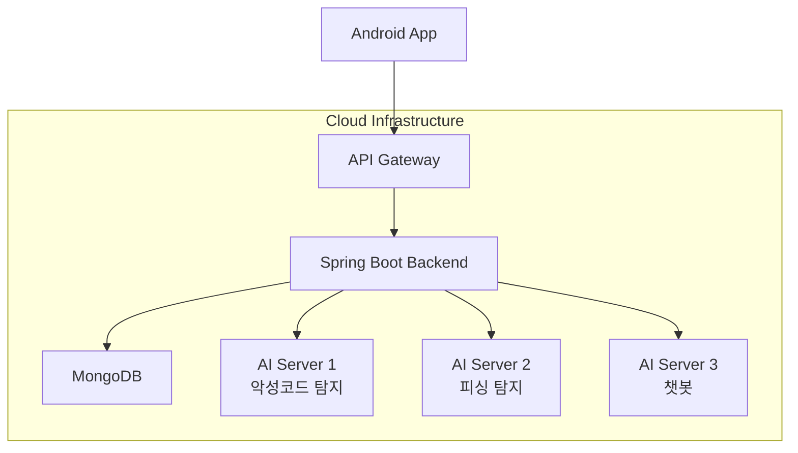

# 팬텀 (Phantom) - 클라우드 AI 기반 안드로이드 보안 솔루션


## 📋 목차

- [프로젝트 소개](#-프로젝트-소개)
- [주요 기능](#-주요-기능)
- [시스템 아키텍처](#-시스템-아키텍처)
- [기술 스택](#-기술-스택)
- [프로젝트 구조](#-프로젝트-구조)
- [API 문서](#-api-문서)
- [설치 및 실행](#-설치-및-실행)
- [개발 현황](#-개발-현황)
- [향후 계획](#-향후-계획)

## 🚀 프로젝트 소개

**팬텀(Phantom)**은 모든 안드로이드 사용자가 전문가 수준의 보안을 손쉽게 누릴 수 있도록 돕는 클라우드 AI 기반 보안 솔루션입니다.

사용자의 기기에서 발생하는 다양한 위협(악성코드, 피싱)을 실시간으로 탐지 및 차단하고, 개인화된 보안 컨설팅을 제공하여 능동적인 자기 보호 능력을 길러주는 것을 목표로 합니다.

### 🎯 프로젝트 비전
- **전문가 수준의 보안을 모든 사용자에게**
- **AI 기반 실시간 위협 탐지**
- **개인화된 보안 컨설팅 제공**

## ✨ 주요 기능

### 🛡️ 1. 지능형 악성코드 탐지 및 차단
- **실시간 탐지**: 앱 설치/파일 다운로드 시 즉시 분석
- **AI 기반 분석**: 기존 시그니처 방식을 넘어선 행동 패턴 분석
- **자동 차단**: 위험 수준에 따른 자동 차단 및 알림

### 🎣 2. AI 기반 피싱 방어 시스템
- **텍스트 분석**: SMS/이메일 내용의 언어적 특징 분석
- **URL 검증**: 의심스러운 링크 및 도메인 탐지
- **상황 인식**: 긴급성, 강압적 어조 등 심리적 요소 분석

### 🤖 3. 개인 맞춤형 보안 컨설팅 챗봇
- **실시간 상담**: 보안 관련 질문에 즉시 답변
- **개인화 서비스**: 사용자별 위협 이력 기반 맞춤 조언
- **학습 기능**: 대화 패턴 학습을 통한 응답 품질 향상

## 🏗️ 시스템 아키텍처



### 네트워크 플로우
- **클라이언트**: 안드로이드 앱에서 데이터 수집 및 사용자 인터페이스 제공
- **API Gateway**: 요청 라우팅 및 인증 처리
- **백엔드 서버**: 비즈니스 로직 처리 및 AI 서버 연동
- **AI 서버들**: 각 도메인별 특화된 AI 분석 수행
- **데이터베이스**: 사용자 정보 및 탐지 이력 저장

## 🛠️ 기술 스택

### Backend (Spring Boot)
| 구분 | 기술 | 버전 | 용도 |
|------|------|------|------|
| **Framework** | Spring Boot | 3.3.5 | 메인 백엔드 프레임워크 |
| **Language** | Java | 17 | 개발 언어 |
| **Database** | MongoDB | 7.0.23 | NoSQL 데이터베이스 |
| **Security** | Spring Security + JWT | - | 인증 및 인가 |
| **Build Tool** | Gradle | 8.4+ | 빌드 자동화 |

### AI Servers (Python)
| 구분 | 기술 | 버전 | 용도 |
|------|------|------|------|
| **Language** | Python | 3.10.10 | AI 개발 언어 |
| **Framework** | Flask/FastAPI | - | AI 서버 프레임워크 |
| **ML Library** | scikit-learn, XGBoost | - | 악성코드 탐지 |
| **NLP** | TensorFlow, Transformers | - | 피싱 탐지 & 챗봇 |

### Mobile (Android)
| 구분 | 기술 | 버전 | 용도 |
|------|------|------|------|
| **Platform** | Android | API 33 | 모바일 플랫폼 |
| **IDE** | Android Studio | Narwhal | 개발 환경 |
| **Build Tool** | Gradle | 8.4+ | 빌드 도구 |

### Infrastructure
| 구분 | 기술 | 용도 |
|------|------|------|
| **Containerization** | Docker | 애플리케이션 컨테이너화 |
| **Cloud** | AWS | 클라우드 인프라 |
| **CI/CD** | GitHub Actions | 자동화 배포 |

## 📁 프로젝트 구조

```
phantom-security/
├── 📁 backend/                          # Spring Boot 백엔드
│   ├── 📁 src/main/java/com/phantom/security/
│   │   ├── 📁 config/                   # 설정 클래스
│   │   │   ├── SecurityConfig.java      # Spring Security 설정
│   │   │   ├── PasswordConfig.java      # 암호화 설정
│   │   │   └── RestTemplateConfig.java  # HTTP 클라이언트 설정
│   │   ├── 📁 controller/               # REST API 컨트롤러
│   │   │   ├── AuthController.java      # 인증 관련 API
│   │   │   ├── UserController.java      # 사용자 관리 API
│   │   │   ├── MalwareController.java   # 악성코드 탐지 API
│   │   │   ├── PhishingController.java  # 피싱 탐지 API
│   │   │   └── ChatbotController.java   # 챗봇 API
│   │   ├── 📁 service/                  # 비즈니스 로직
│   │   │   ├── AuthService.java         # 인증 서비스
│   │   │   ├── UserService.java         # 사용자 서비스
│   │   │   ├── MalwareService.java      # 악성코드 서비스
│   │   │   ├── PhishingService.java     # 피싱 서비스
│   │   │   └── ChatbotService.java      # 챗봇 서비스
│   │   ├── 📁 repository/               # 데이터 접근 계층
│   │   │   ├── UserRepository.java
│   │   │   ├── MalwareScanLogRepository.java
│   │   │   ├── PhishingScanLogRepository.java
│   │   │   └── ChatbotLogRepository.java
│   │   ├── 📁 model/                    # 데이터 모델
│   │   │   ├── User.java                # 사용자 모델
│   │   │   ├── MalwareScanLog.java      # 악성코드 스캔 로그
│   │   │   ├── PhishingScanLog.java     # 피싱 스캔 로그
│   │   │   └── ChatbotLog.java          # 챗봇 대화 로그
│   │   ├── 📁 dto/                      # 데이터 전송 객체
│   │   │   ├── 📁 request/              # 요청 DTO
│   │   │   └── 📁 response/             # 응답 DTO
│   │   ├── 📁 security/                 # 보안 관련
│   │   │   ├── JwtUtil.java             # JWT 유틸리티
│   │   │   └── JwtAuthenticationFilter.java # JWT 인증 필터
│   │   └── 📁 exception/                # 예외 처리
│   │       ├── GlobalExceptionHandler.java
│   │       ├── UserAlreadyExistsException.java
│   │       ├── InvalidCredentialsException.java
│   │       └── UserNotFoundException.java
│   ├── 📁 src/main/resources/
│   │   └── application.yml              # 애플리케이션 설정
│   ├── build.gradle.kts                 # Gradle 빌드 설정
│   └── docker-compose.yml               # Docker 컨테이너 설정
├── 📁 ai-servers/                       # AI 서버들 (예정)
│   ├── 📁 malware-detection/            # 악성코드 탐지 AI
│   ├── 📁 phishing-detection/           # 피싱 탐지 AI
│   └── 📁 chatbot/                      # 챗봇 AI
├── 📁 android-app/                      # Android 앱 (예정)
├── 📁 docs/                             # 문서
│   ├── api-spec.md                      # API 명세서
│   ├── database-schema.md               # 데이터베이스 스키마
│   └── user-stories.md                  # 사용자 스토리
└── 📁 tests/                            # 테스트 파일
    ├── auth-test.http                   # 인증 API 테스트
    ├── user-management-test.http        # 사용자 관리 테스트
    ├── malware-test.http               # 악성코드 API 테스트
    ├── phishing-test.http              # 피싱 API 테스트
    └── chatbot-test.http               # 챗봇 API 테스트
```

## 📖 API 문서

### 🔐 인증 API (`/api/auth`)

| Method | Endpoint | 설명 | 인증 필요 |
|--------|----------|------|-----------|
| `POST` | `/signup` | 회원가입 | ❌ |
| `POST` | `/login` | 로그인 | ❌ |
| `POST` | `/find-id` | 아이디 찾기 | ❌ |
| `POST` | `/forgot-password` | 비밀번호 재설정 링크 요청 | ❌ |

### 👤 사용자 관리 API (`/api/user`)

| Method | Endpoint | 설명 | 인증 필요 |
|--------|----------|------|-----------|
| `GET` | `/profile` | 프로필 조회 | ✅ |
| `PUT` | `/profile` | 프로필 수정 | ✅ |
| `PUT` | `/change-password` | 비밀번호 변경 | ✅ |
| `PUT` | `/settings/malware` | 악성코드 탐지 설정 | ✅ |
| `PUT` | `/settings/phishing` | 피싱 탐지 설정 | ✅ |
| `DELETE` | `/delete` | 계정 삭제 | ✅ |

### 🦠 악성코드 탐지 API (`/api/malware`)

| Method | Endpoint | 설명 | 인증 필요 |
|--------|----------|------|-----------|
| `POST` | `/scan` | 악성코드 스캔 요청 | ✅ |
| `GET` | `/history` | 탐지 이력 조회 | ✅ |
| `GET` | `/statistics` | 탐지 통계 조회 | ✅ |

### 🎣 피싱 탐지 API (`/api/phishing`)

| Method | Endpoint | 설명 | 인증 필요 |
|--------|----------|------|-----------|
| `POST` | `/scan` | 피싱 스캔 요청 | ✅ |
| `GET` | `/history` | 탐지 이력 조회 | ✅ |
| `GET` | `/statistics` | 탐지 통계 조회 | ✅ |

### 🤖 챗봇 API (`/api/chatbot`)

| Method | Endpoint | 설명 | 인증 필요 |
|--------|----------|------|-----------|
| `POST` | `/message` | 챗봇 메시지 전송 | ✅ |
| `GET` | `/history` | 대화 기록 조회 | ✅ |
| `POST` | `/feedback` | 응답 피드백 제출 | ✅ |
| `GET` | `/statistics` | 챗봇 사용 통계 | ✅ |

## 🚀 설치 및 실행

### 사전 요구사항
- Java 17+
- Docker & Docker Compose
- MongoDB
- Gradle 8.4+

### 1. 저장소 클론
```bash
git clone https://github.com/your-username/phantom-security.git
cd phantom-security
```

### 2. MongoDB 환경 구축
```bash
# MongoDB Docker 컨테이너 실행
docker-compose up -d mongodb

# MongoDB 초기화 (사용자 생성)
docker exec -it phantom-mongodb mongosh -u admin -p "phantom2025!" --authenticationDatabase admin
```

### 3. 백엔드 서버 실행
```bash
cd backend
./gradlew bootRun
```

### 4. API 테스트
```bash
# 회원가입 테스트
curl -X POST http://localhost:8080/api/auth/signup \
  -H "Content-Type: application/json" \
  -d '{"email":"test@phantom.com","password":"testpassword123!","phoneNumber":"01012345678"}'

# 로그인 테스트
curl -X POST http://localhost:8080/api/auth/login \
  -H "Content-Type: application/json" \
  -d '{"email":"test@phantom.com","password":"testpassword123!"}'
```

## 🗄️ 데이터베이스 스키마

### MongoDB 컬렉션 구조

#### 👥 users
```javascript
{
  "_id": "ObjectId",
  "email": "string (unique)",
  "password_hash": "string",
  "phone_number": "string",
  "is_malware_detection_enabled": "boolean",
  "is_phishing_detection_enabled": "boolean",
  "created_at": "datetime",
  "updated_at": "datetime"
}
```

#### 🦠 malware_scan_logs
```javascript
{
  "_id": "ObjectId",
  "user_id": "ObjectId",
  "device_id": "string",
  "scan_type": "string", // "realtime" | "manual"
  "target_package_name": "string",
  "target_hash": "string",
  "scan_result": "string", // "safe" | "malicious" | "suspicious"
  "threat_name": "string",
  "detected_at": "datetime",
  "is_blocked": "boolean"
}
```

#### 🎣 phishing_scan_logs
```javascript
{
  "_id": "ObjectId",
  "user_id": "ObjectId", 
  "device_id": "string",
  "source_type": "string", // "sms" | "email"
  "text_content": "string",
  "suspicious_url": "string",
  "scan_result": "string", // "safe" | "phishing"
  "detected_at": "datetime"
}
```

#### 🤖 chatbot_logs
```javascript
{
  "_id": "ObjectId",
  "user_id": "ObjectId",
  "user_message": "string",
  "chatbot_response": "string",
  "sent_at": "datetime"
}
```

## 📊 개발 현황

### ✅ 완료된 기능
- [x] **백엔드 API 서버** (Spring Boot 3.3.5)
    - [x] 회원 관리 시스템 (가입, 로그인, 프로필 관리)
    - [x] JWT 기반 인증 및 권한 관리
    - [x] 악성코드 탐지 API (폴백 로직 포함)
    - [x] 피싱 탐지 API (폴백 로직 포함)
    - [x] 챗봇 API (폴백 로직 포함)
    - [x] 데이터베이스 설계 및 연동 (MongoDB)
    - [x] 전체 API 테스트 완료

- [x] **개발 환경 구축**
    - [x] Docker 기반 MongoDB 환경
    - [x] Spring Security 보안 설정
    - [x] 예외 처리 및 로깅 시스템
    - [x] API 문서화 및 테스트 케이스

### 🚧 진행 중인 작업
- [ ] **AI 서버 개발**
    - [ ] 악성코드 탐지 AI (Python + scikit-learn/XGBoost)
    - [ ] 피싱 탐지 AI (Python + TensorFlow/NLP)
    - [ ] 챗봇 AI (Python + Transformers/LangChain)

## 📞 연락처

프로젝트 문의: [pyosang0919@gmail.com](mailto:your-email@example.com)

---

<div align="center">

**팬텀(Phantom) - 모든 안드로이드 사용자를 위한 지능형 보안 솔루션**

[](https://github.com/your-username/phantom-security/stargazers)
[](https://github.com/your-username/phantom-security/network/members)
[](https://github.com/your-username/phantom-security/issues)

</div>